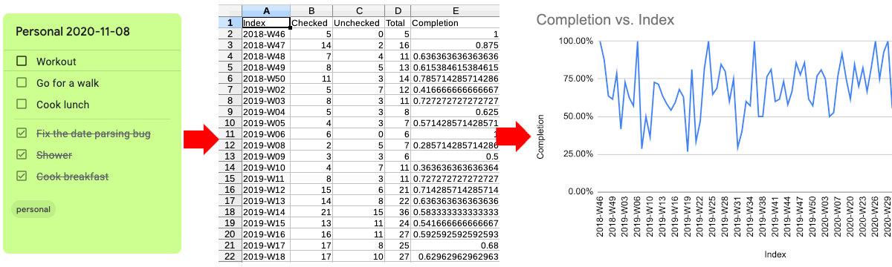

# Google Keep TODO

Statistics exporter and task planner for Google Keep task lists.



Commands:

- `stats` - export statistics for task lists as CSV
- `plan` - schedule regular task lists from template

Features:

- Calculate overall completion rate for task lists by keyword
- Aggregate task list completion daily/weekly/monthly/yearly
- Export time series data and aggregates as CSV
- Configurable date formats

Supported metrics:

- Number of checked items
- Number of unchecked items
- Total items
- Completion rate

## Installation

This script requires Python 3, https://github.com/kiwiz/gkeepapi, and a couple more libraries to run. Install the pre-requisite libraries via Pip3:

```
pip3 install -r requirements.txt
```

Optional: make the script executable:

```
chmod +x gkeeptodo.py
```

## Usage

This tool is configured via a config file, to avoid reentering parameters on every call. Copy the example config file:

```
cp gkeeptodo.example.ini gkeeptodo.ini
```

And edit it to come up with your own setup.

Then you can simply call the script in one of the available ways:

```
python3 gkeeptodo.py
# or
./gkeeptodo.py
```

For available command line options see the help page:

```
./gkeeptodo.py -h
```

### Authentication

gkeeptodo can use the operating system key ring to save the access token securely. First time you need to authenticate with your password by running the `login` command:

```
./gkeeptodo.py login
```

If it authenticates successfully and your operating system supports key ring, access token is saved and from the next time onwards you can use it without `login` and password prompt won't be necessary:

```
./gkeeptodo.py
```

### Collecting statistics

Default command is `stats` which collects statistics, given the metrics configured in the config file. Calling

```
./gkeeptodo.py stats
```

is equivalent to just

```
./gkeeptodo.py
```

### Output

By default, CSV export is written to files in the current folder. Each metric is written in a separate file called `{Metric}_{mode}_{timestamp}.csv`.

You can disable CSV export by adding `--dry` option:

```
./gkeeptodo.py --dry
```

Use the `--verbose` or `-v` option to enable verbose printing of the results in the console, e.g.:

```
./gkeeptodo.py -v
./gkeeptodo.py -v --dry
```

### Planning repetitive task lists

With

```
./gkeeptodo.py plan -f <from-date> -t <to-date>
```

you can create repetitive task lists in your Google Keep account from template. An example template is described in [gkeeptodo.example.ini](./gkeeptodo.example.ini). More information on how to configure templates in the [Configuration section](#Templates).

For instance, if you have a `daily` template configured in the `gkeeptodo.ini` file, you can generate a task list per each day from 1st of January 2021 to 9th of January 2021 with the following command:

```
./gkeeptodo.py plan -f 2021-01-01 -t 2021-01-09
```

## Configuration

This section describes configuration options available in `gkeeptodo.ini` file. See also [gkeeptodo.example.ini](./gkeeptodo.example.ini).

### User

The user section is an easy way to save your Google account, so you don't have to enter it manually every time you use the command.

```ini
[user]
email=user.email@example.com
```

### Formats

The formats section sets up date formats that you use in the titles for your task lists. It helps the program parse your TODO titles like `Cooking 2020-12-30` and understand that the task category is `Cooking` and the date is `30th of December, 2020`. Or vice versa, when generating TODOs from templates, it helps to put the correct dates in the generated task list titles.

 The script uses directives described in [Python's strptime function docs](https://docs.python.org/3/library/datetime.html#strftime-strptime-behavior). The default ones use ISO-like formats:

```ini
[formats]
yearly=%Y      # example: 2020
monthly=%Y-%m  # example: 2020-12
weekly=%Y-W%W  # example: 2020-W52
daily=%Y-%m-%d # example: 2020-12-24
```

For example, `%Y` will be replaced with an actual year and become `2021`. Or vice versa, when scanning your TODOs, given `%Y` in the date pattern, it expects a year number to be in that position.

Here is another example using US date format:

```ini
[formats]
yearly=%Y      # example: 2020
monthly=%B %Y  # example: December 2020
weekly=%Y-W%W  # example: 2020-W52
daily=%m/%d/%Y # example: 12/24/2020
```

### Metrics

Metrics configure statistics collected per category. Each `metric` entry corresponds to one category. There can be multiple metrics in the configuration, and each metric may collect data and output statistics in multiple modes. Example:

```ini
[metric: Work]
keyword=Work
modes=total, weekly, monthly
```

In this example we create a metic called `Work` which measures progress on task lists in "Work" category.

The `keyword` is used as a category prefix. The script will search all your Google Keep task lists that start with that keyword and are followed by corresponding date formats (see Formats section above). For example, it will match entries like `Work 2020-12-01` and `Work 2020-12-02` and put them in category `Work` as 2 data points for different days.

The `modes` is a comma separated list of interval types which you want to collect statistics for. For example, if you want statistics aggregated by month, you should add `monthly` mode to the list. In the above example we ar interested in overall statistics, as well as data aggregated by week and month.

All supported modes are:

- `total` - overall statistics for all time
- `yearly` - statistics aggregated by year
- `monthly` - statistics aggregated by month
- `daily` - statistics for every day

### Templates

Templates are used to [plan repetitive task lists](#Planning-repetitive-task-lists). Each `template` entry configures a task list. You can add more than one template in configuration.

Example:

```ini
[template: Wellness]
title=Wellness {date} # {date} is replaced with actual formatted date
items=Meditate, Walk outside, Workout
mode=daily
labels=personal # optional, comma separated
color=green # optional
```

The name of this template is `Wellness`. And as the `title` goes, each title will start with prefix `Wellness` followed by a date, e.g. `2020-12-24`.

The `mode` setting configures the frequency interval, which is used to generate a sequence of task lists with this template. Valid modes are: `daily`, `weekly`, `monthly`, `yearly`. For example, in `weekly` mode given a range from `2021-01-01` to `2021-01-30` the tool will generate 5 task lists: `2020-W53`, `2021-W01`, `2021-W02`, `2021-W03`, `2021-W04`, each of them prefixed with the keyword according to `title` format (which is "Wellness" in the example above).

The `items` option contains comma separated tasks for the task list.

The `labels` are comma separated labels. You should already have these labels configured in your Google Keep account, non-existent labels are ignored. This setting is optional.

The `color` option assigns a color to the note in Google Keep. Supported values: `blue`, `brown`, `dark-blue`, `gray`, `green`, `orange`, `pink`, `purple`, `red`, `teal`, `white`, `yellow`. This setting is optional.

## Credits

This tool uses the unofficial Google Keep API https://github.com/kiwiz/gkeepapi by [kiwiz](https://github.com/kiwiz). Google Keep is of course a registered trademark of Google and neither the API nor this script are affiliated with Google.
